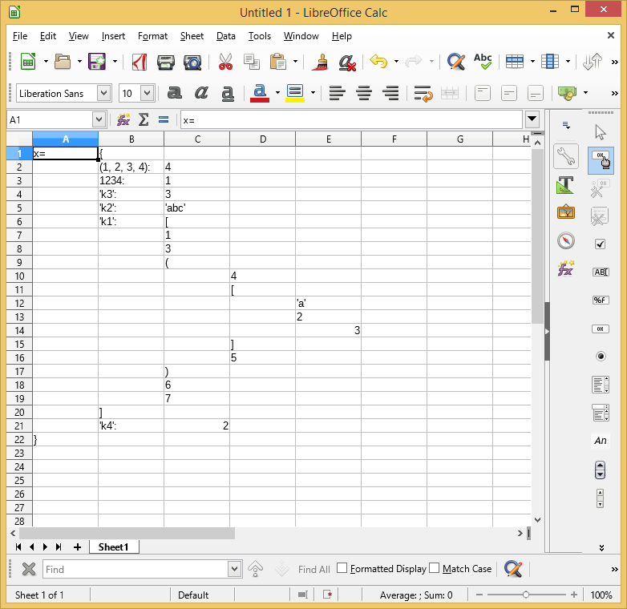

<pre>
# LibrePyListEditor
Use Libre/Open Office Calc as Tree/Grid View for Browsing and Editing Python Nested List/Dict/Tuple 
Using UNO or COM 

## System requirements
### Linux: 
Libre Office or Open Office, Python 2.7 or 3.x, uno package.
### Windows: 
Libre Office or Open Office,  Python 2.7 or 3.x, uno package or comtypes packeage.

## Purpose
This project is created for using Libre/Open office Calc Spread Sheet program as a grid view / tree view 
control for displaying and editing list, dictionary or tuple variables from Python command prompt. It 
provides a GUI tool for people who need to deal with long and deeply nested lists interactively on an 
Python commnad prompt.

## How it works
This program can use either COM or UNO as the bridge to the Calc program, so it is not passing data thru 
files. 

What this program do is to display list variable in a simplified and tokenized Python syntax on spread 
sheet where each token is stored in a cell (it supports str, float and int). Nested list is shown using 
indentation and sub list can be expanded or collapsed interactively. The modified list can be read back 
from the Python command prompt after you finished changing it on the spread sheet.

## Dependencies
- Libre / Open Office (tested with Libre Office 5.4.2.2 (x64) on Windows 8.1, other versions and OSes 
should work) and the Python interpreter bundled in the Office installation. 
- A Python installation other than the one bundled with Office. It requires "comtypes" package to be 
installed (I used Anaconda Python installer which included this package). (Not necessary if you can use 
the bundled Python for your work.)

## A Simple Demo
(paths given may be slightly different from your machine)
1. Start Calc with special command line parameters to allow for control thru COM or UNO from Python 
interpreter.
	- On Windows, type this on command prompt:
 
		"C:\Program Files\LibreOffice 5\program\soffice.exe" "--calc" --accept=\
		"socket,host=localhost,port=2002;urp;"
	
	- On Linux, type this on terminal:

		soffice --calc --accept="socket,host=localhost,port=2002;urp;StarOffice.ServiceManager"

2. Start Python Command Prompt:
	- On Windows,
		- using Office bundled Python, type:
			"C:\Program Files\LibreOffice 5\program\python.exe"
		- using other Python, type
			C:\Program Files (x86)\Anaconda2\python.exe
	- On Linux, type:
		/usr/bin/python
		or
		/usr/bin/python3

3. On the Python command prompt, type

>>> import LibrePyListEditor as li
>>> li.a
{(1, 2, 3, 4): 4, 1234: 1, 'k3': 3, 'k2': 'abc', 'k1': [1, 3, (4, ['a', 2, 3.0], 5), 6, 7], 'k4': 2.0}
>>> li.var_to_sheet(li.a)

The current sheet of Calc will show the content of variable li.a. Now make some random changes to some of
the values. Remember to press enter after editting the cells to commit the change to the cells.
</pre>

<pre>

>>> x = li.sheet_to_var()
>>> x
{(1, 2, 3, 4): 4, 'k1': [1, 3, (4, ['a', 2, 3.0], 5), 6, 7], 'k3': 3, 'k2':abc', 1234: 1, 'k4': 3.0}
>>>

## References
</pre>
1. http://christopher5106.github.io/office/2015/12/06/openoffice-libreoffice-automate-your-office-tasks-with-python-macros.html
2. https://stackoverflow.com/questions/10166064/python-win32com-and-2-dimensional-arrays
